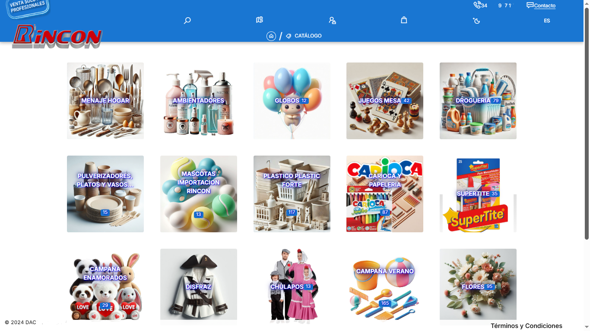

# SHOPPRO

## Lightweight and Adaptable Ecommerce Platform

**Introduction:**
This report outlines the architecture and fundamental features of an e-commerce platform developed with Quasar v2 and Vue 3, designed to offer an agile and efficient user experience while adhering to European regulations and facilitating scalability through a centralized API.

**General Architecture:**
The platform is based on a Single Page Application (SPA) architecture built with Quasar v2 and Vue 3 for the frontend, communicating via a RESTful API developed with Node.js and Express in the backend. This separation of responsibilities offers the following advantages:

* **Improved Performance:** The SPA nature allows for smooth transitions between pages and faster initial loading, optimizing the user experience.
* **Scalability:** The centralized API facilitates the connection of multiple frontends (different websites for various categories or dropshipping) to a single database and business logic.
* **Maintainability:** The clear separation between frontend and backend simplifies the development, testing, and maintenance of each component.
* **Flexibility:** It allows for the integration of future functionalities and adaptation to different types of products or services through specific modules.

**Key Features of the Frontend (Quasar v2 + Vue 3):**

* **Lightweight Design Focused on User Experience:** The choice of Quasar v2 and Vue 3 emphasizes the creation of a reactive and high-performance user interface, prioritizing the effective presentation of product information without overloading the project with unnecessary modules.
* **Adaptability to European Regulations:** Development focuses on the integration of legal requirements and certifications necessary to operate in the European Union, including data privacy considerations (GDPR), clear terms and conditions, and the ability to incorporate specific modules for electronic invoicing and VeriFactu as regulations evolve.
* **Dynamic Modularity:** The SPA architecture allows for the implementation of specific functionality modules for different types of products or services. These modules are dynamically integrated only when needed, keeping the application core lightweight and optimized for each context.
* **SEO Optimization for SPAs:** Dynamic SEO strategies are implemented for SPAs, addressing traditional indexing challenges. This includes:
    * **Dynamic Metadata Management:** Updating titles, descriptions, and meta tags based on dynamic page content, implementing data update timestamps.
    * **Dynamic XML Sitemap Generation:** To ensure proper indexing of all URLs, multiple XML files are generated from the API, as the SPA is only served as a frontend. LLMS.TXT markdown files are also automatically generated, a strategy focused on Optimal Generation and Extraction of information for Large Language Models (LLMs) and other AI crawlers.
    * **Schema Markup Implementation:** To provide structured information to search engines about products and the company.
    * **URLs Combined with Codes and Slugs:** Displayed dynamically or created from sitemap.xml. For example, for products in , URLs could be like `https://lapayasa.com/product/view/child_warrior_costume/00003`. For categories in ,  examples would be `https://universofiesta.com/product/view/child_warrior_costume/00003`. And for specific products in , URLs like `https://dacartoys.es/product/view/coco_lubrex_350ml_hand_soap/00003` could be generated.
    * **Internal Link Building Strategies:** To improve navigation and the authority of important pages.
* **Fluid Connection with the API:** Communication with the Node.js + Express API is carried out efficiently through asynchronous requests, ensuring a reactive and uninterrupted user experience.

**Key Features of the Backend (Node.js + Express):**

* **Unified and Robust API:** The backend with Node.js and Express provides a centralized RESTful API to manage all aspects of the e-commerce, including product, user, order, and payment management, as well as interaction with external services (MariaDB and S3).
* **Integration with MariaDB:** MariaDB is used as the database management system to efficiently and securely store product catalog information, users, orders, and other relevant data.
* **Integration with S3 Compatible Storage:** An Amazon S3 compatible storage service is integrated for managing product images, documents, and other multimedia files, offering scalability and high availability.
* **Support for Specific Modules:** The backend architecture is designed to facilitate the integration of specific modules for different types of products or services, allowing for customized business logic based on needs.
* **Adaptability to Electronic Invoicing and VeriFactu:** The backend is designed with the necessary flexibility to incorporate modules corresponding to electronic invoicing and the VeriFactu system as regulations are implemented and updated.
* **Security:** Robust security measures are implemented to protect user data and transactions, including data validation, protection against common attacks (such as SQL injection and XSS), and secure credential management.

**Key Benefits of the Solution:**

* **Optimal Performance:** The combination of a lightweight SPA and an efficient API ensures a fast and fluid user experience.
* **Horizontal Scalability:** The decoupled architecture allows for independent scaling of both the frontend (adding more servers to serve the application) and the backend (scaling the API and database) according to demand.
* **Adaptability and Flexibility:** Modularity in both the frontend and backend facilitates the incorporation of new functionalities and adaptation to different types of products and services without affecting the stability of the application core.
* **Regulatory Compliance:** The proactive focus on integrating European legal requirements ensures that the platform can operate within the current regulatory framework and adapt to future changes.
* **Dynamic SEO:** The implementation of specific strategies for SPAs improves visibility in search engines and attracts organic traffic.
* **Simplified Maintenance:** The separation of layers facilitates the identification and resolution of problems, as well as the implementation of updates.

**Conclusion:**
The e-commerce platform developed with Quasar v2, Vue 3, Node.js, Express, MariaDB, and S3-compatible storage represents a modern, lightweight, and highly adaptable solution for online commerce. Its focus on efficiency, modularity, and regulatory compliance positions it as a powerful tool for businesses seeking an effective and scalable online presence. The development strategy as an SPA connected to a centralized API offers exceptional flexibility for expansion into different market niches and business models such as dropshipping. The dedicated attention to dynamic SEO ensures that the platform can compete effectively in the digital environment.
