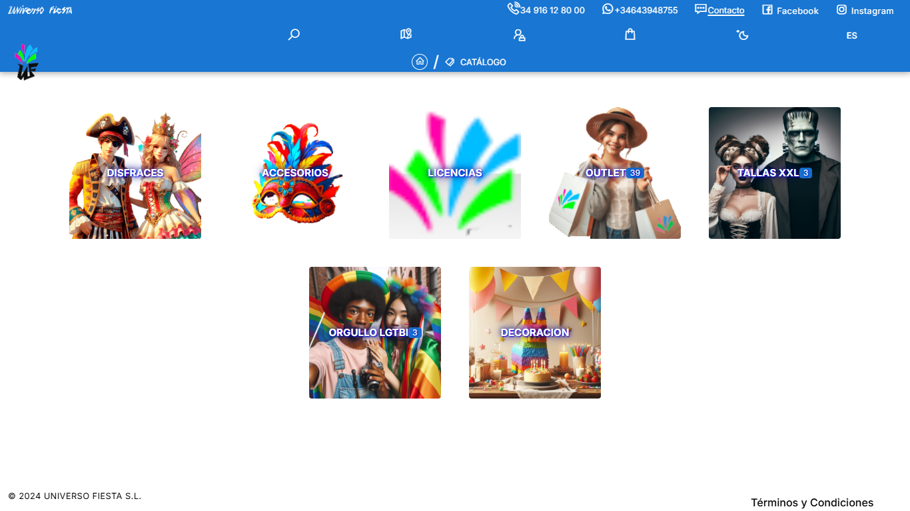
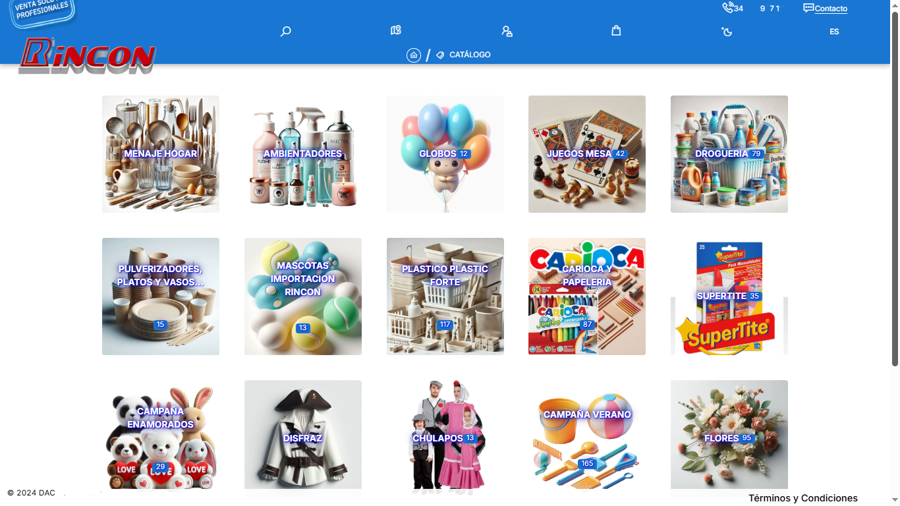

# SHOPPRO
# Plataforma de Ecommerce Ligera y Adaptable

**Introducción:**

Este informe describe la arquitectura y las características fundamentales de una plataforma de comercio electrónico desarrollada con Quasar v2 y Vue 3, diseñada para ofrecer una experiencia de usuario ágil y eficiente, al tiempo que se adhiere a las normativas europeas y facilita la escalabilidad mediante una API centralizada.

**Arquitectura General:**

La plataforma se fundamenta en una arquitectura de Single Page Application (SPA) construida con Quasar v2 y Vue 3 para el frontend, comunicándose a través de una API RESTful desarrollada con Node.js y Express en el backend. Esta separación de responsabilidades ofrece las siguientes ventajas:

* **Rendimiento Mejorado:** La naturaleza SPA permite transiciones fluidas entre páginas y una carga inicial más rápida, optimizando la experiencia del usuario.
* **Escalabilidad:** La API centralizada facilita la conexión de múltiples frontends (diferentes sitios web para distintas categorías o dropshipping) a una única base de datos y lógica de negocio.
* **Mantenibilidad:** La separación clara entre frontend y backend simplifica el desarrollo, las pruebas y el mantenimiento de cada componente.
* **Flexibilidad:** Permite la integración de futuras funcionalidades y la adaptación a diferentes tipos de productos o servicios mediante módulos específicos.

**Características Clave del Frontend (Quasar v2 + Vue 3):**

* **Diseño Ligero y Centrado en la Experiencia del Usuario:** La elección de Quasar v2 y Vue 3 enfatiza la creación de una interfaz de usuario reactiva y de alto rendimiento, priorizando la presentación efectiva de la información del producto sin sobrecargar el proyecto con módulos innecesarios.
* **Adaptabilidad a la Normativa Europea:** El desarrollo se enfoca en la integración de los requisitos legales y certificaciones necesarias para operar en la Unión Europea, incluyendo consideraciones de privacidad de datos (GDPR), términos y condiciones claros, y la capacidad de incorporar módulos específicos para la facturación electrónica y VeriFactu a medida que evolucionan las normativas.
* **Modularidad Dinámica:** La arquitectura SPA permite la implementación de módulos de funcionalidad específicos para diferentes tipos de productos o servicios. Estos módulos se integran dinámicamente solo cuando son necesarios, manteniendo el núcleo de la aplicación ligero y optimizado para cada contexto.
* **Optimización SEO para SPAs:** Se implementan estrategias dinámicas de SEO para SPAs, abordando los desafíos tradicionales de indexación. Esto incluye:
    * **Gestión Dinámica de Metadatos:** Actualización de títulos, descripciones y etiquetas meta en función del contenido dinámico de la página.
    * **Generación de Sitemap XML Dinámico:** Para asegurar la correcta indexación de todas las URLs.
    * **Implementación de Schema Markup:** Para proporcionar información estructurada a los motores de búsqueda sobre los productos y la empresa.
    * **Url's combinadas con códigos y slugs:** Se muestran dinámicamente o bien crean una dirección desde sitemap.xml. Por ejemplo, para productos en [][https://lapayasa.com](https://lapayasa.com), las URLs podrían ser como `[https://lapayasa.com/product/view/disfraz_guerrero_infantil/00003](https://lapayasa.com/product/view/disfraz_guerrero_infantil/00003)`. Para categorías en [][https://universofiesta.com](https://universofiesta.com), ejemplos serían `https://universofiesta.com/product/view/disfraz_guerrero_infantil/00003`. Y para productos específicos en [][https://dacartoys.es](https://dacartoys.es), se podrían generar URLs como `[[https://dacartoys.es/juguete/456-coche-radiocontrol](https://dacartoys.es/product/view/jabon_manos_350ml_coco_lubrex/00003)](https://dacartoys.es/product/view/jabon_manos_350ml_coco_lubrex/00003)`.
    * **Estrategias de Link Building Interno:** Para mejorar la navegación y la autoridad de las páginas importantes.
* **Conexión Fluida con la API:** La comunicación con la API Node.js + Express se realiza de forma eficiente mediante peticiones asíncronas, garantizando una experiencia de usuario reactiva y sin interrupciones.

**Características Clave del Backend (Node.js + Express):**

* **API Unificada y Robusta:** El backend con Node.js y Express proporciona una API RESTful centralizada para gestionar todos los aspectos del ecommerce, incluyendo la gestión de productos, usuarios, pedidos, pagos y la interacción con los servicios externos (MariaDB y S3).
* **Integración con MariaDB:** Se utiliza MariaDB como sistema de gestión de bases de datos para almacenar de forma eficiente y segura la información del catálogo de productos, usuarios, pedidos y otra información relevante.
* **Integración con S3 Compatible:** Se integra un servicio de almacenamiento compatible con Amazon S3 para la gestión de imágenes de productos, documentos y otros archivos multimedia, ofreciendo escalabilidad y alta disponibilidad.
* **Soporte para Módulos Específicos:** La arquitectura del backend está diseñada para facilitar la integración de módulos específicos para diferentes tipos de productos o servicios, permitiendo una lógica de negocio personalizada según las necesidades.
* **Adaptabilidad a la Facturación Electrónica y VeriFactu:** El backend se diseña con la flexibilidad necesaria para incorporar los módulos correspondientes a la facturación electrónica y el sistema VeriFactu a medida que las normativas se implementan y actualizan.
* **Seguridad:** Se implementan medidas de seguridad robustas para proteger los datos de los usuarios y las transacciones, incluyendo la validación de datos, la protección contra ataques comunes (como inyección SQL y XSS), y la gestión segura de las credenciales.

**Beneficios Clave de la Solución:**

* **Rendimiento Óptimo:** La combinación de una SPA ligera y una API eficiente garantiza una experiencia de usuario rápida y fluida.
* **Escalabilidad Horizontal:** La arquitectura desacoplada permite escalar tanto el frontend (añadiendo más servidores para servir la aplicación) como el backend (escalando la API y la base de datos) de forma independiente según la demanda.
* **Adaptabilidad y Flexibilidad:** La modularidad tanto en el frontend como en el backend facilita la incorporación de nuevas funcionalidades y la adaptación a diferentes tipos de productos y servicios sin afectar la estabilidad del núcleo de la aplicación.
* **Cumplimiento Normativo:** El enfoque proactivo en la integración de los requisitos legales europeos asegura que la plataforma puede operar dentro del marco normativo vigente y adaptarse a futuros cambios.
* **SEO Dinámico:** La implementación de estrategias específicas para SPAs mejora la visibilidad en los motores de búsqueda y atrae tráfico orgánico.
* **Mantenimiento Simplificado:** La separación de capas facilita la identificación y resolución de problemas, así como la implementación de actualizaciones.

**Conclusión:**

La plataforma de ecommerce desarrollada con Quasar v2, Vue 3, Node.js, Express, MariaDB y almacenamiento compatible con S3, representa una solución moderna, ligera y altamente adaptable para el comercio electrónico. Su enfoque en la eficiencia, la modularidad y el cumplimiento normativo la posiciona como una herramienta poderosa para empresas que buscan una presencia online efectiva y escalable. La estrategia de desarrollo como una SPA conectada a una API centralizada ofrece una flexibilidad excepcional para la expansión a diferentes nichos de mercado y modelos de negocio como el dropshipping. La atención dedicada al SEO dinámico asegura que la plataforma puede competir eficazmente en el entorno digital.
